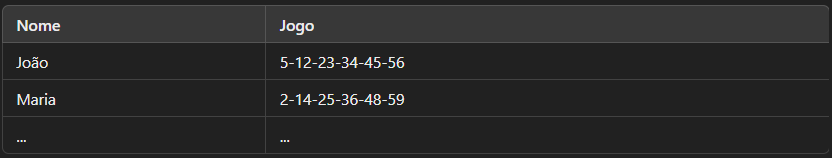

# 🎯 Bolão Mega da Virada - Verificador de Jogos

Uma aplicação em Python com interface gráfica (Tkinter) que lê uma planilha de apostas da Mega da Virada, compara os números sorteados e gera um ranking de acertos. O resultado é exibido na tela e salvo em um arquivo Excel.

## 📌 Funcionalidades

- ✅ Seleciona um arquivo `.xlsx` com os jogos apostados;
- ✅ Recebe os números sorteados;
- ✅ Compara os jogos da planilha com os números sorteados;
- ✅ Exibe a quantidade de acertos de cada participante;
- ✅ Gera um arquivo `resultado_bolao.xlsx` com o ranking de acertos.

## 📁 Formato da Planilha

A planilha Excel deve conter duas colunas obrigatórias:

<p align="center">
    
</p>

- **Nome:** Nome do participante
- **Jogo:** Números apostados separados por hífen (`-`)

## 🛠 Como Executar

1. Instale as dependências necessárias:

```python
pip install pandas openpyxl
```

2. Execute o arquivo Python:

```python
python bolao_mega.py
```

3. Utilize a Interface Gráfica:

- Selecione a planilha com os jogos;
- Digite os números sorteados separados por vírgula (ex: 5,12,23,34,45,56);
- Clique em **"Processar Jogos"**;
- Veja o resultado na tela e o arquivo `resultado_bolao.xlsx` gerado na mesma pasta.

## 📥 Exemplo de Uso

Entrada de Números Sorteados:

```python
5,12,23,34,45,56
```
Saída:

```python
João - Acertos: 6
Maria - Acertos: 2
```
✅ Também será gerado o arquivo `resultado_bolao.xlsx` com os dados ordenados pelos maiores acertos.

## ⚠ Requisitos

- Python 3.x
- Bibliotecas:
    - `tkinter`
    - `pandas`
    - `openpyxl`

## 💻 Tecnologias Utilizadas

- Python
- Tkinter (Interface Gráfica)
- Pandas (Manipulação de dados)
- OpenPyXL (Leitura/Escrita Excel)

## 📜 Licença

Este projeto está licenciado sob a licença MIT - sinta-se livre para utilizar e modificar.

## ✨ Autor

Desenvolvido por Tecla Fernandes
